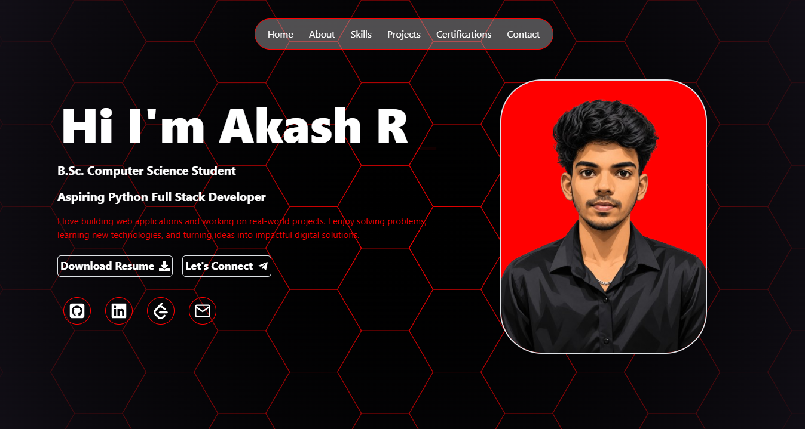
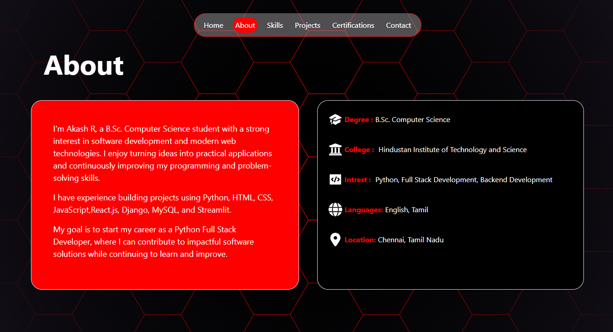
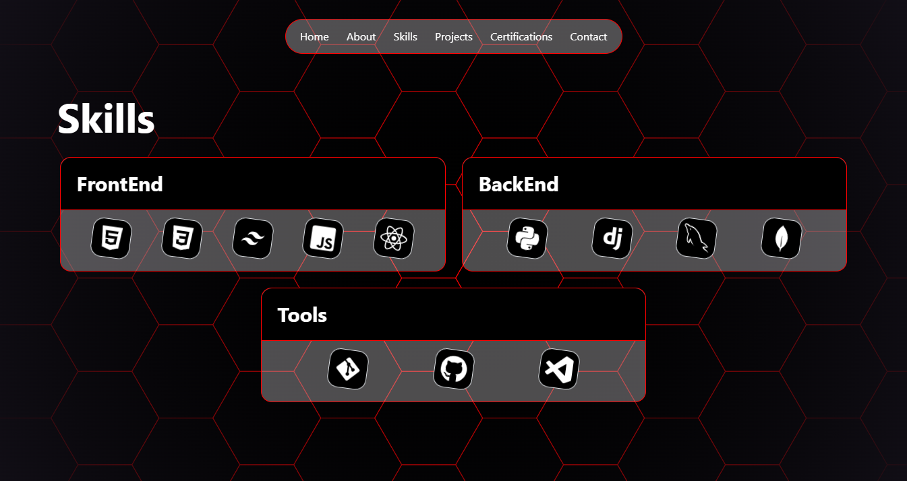
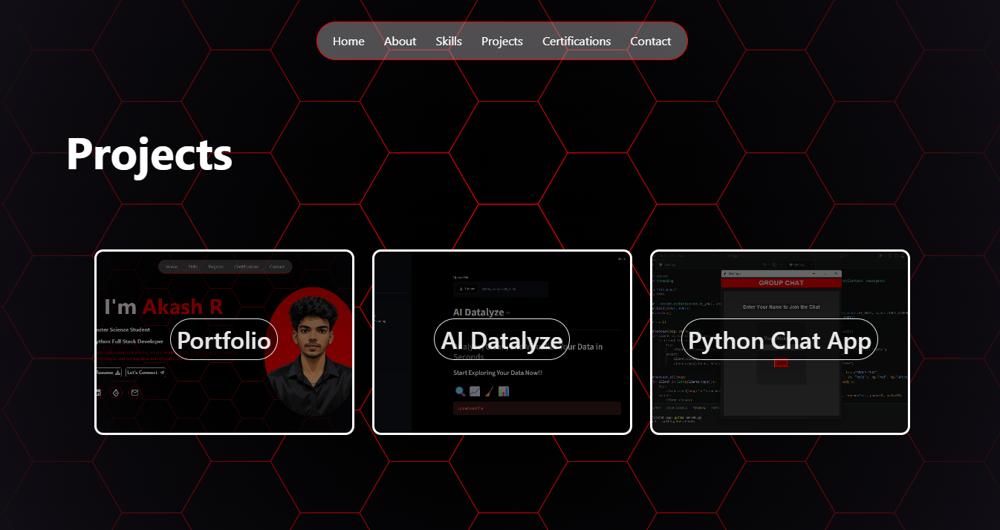
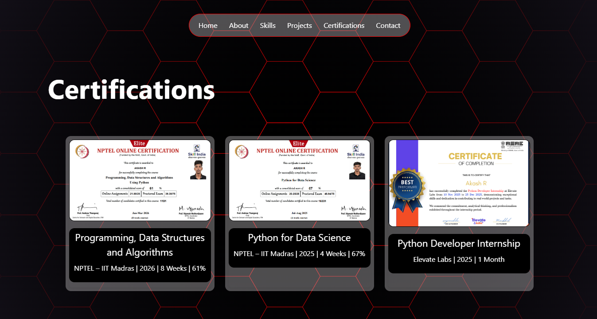
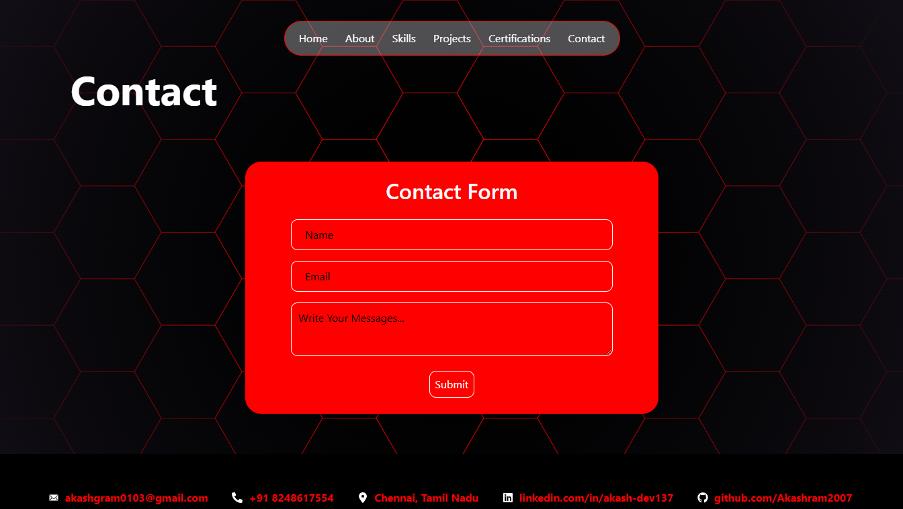

# 🚀 Akash R — Developer Portfolio

A modern, responsive personal portfolio built with **React.js** to showcase my skills, projects, certifications, and developer journey.

The portfolio is designed with a **dark black & red theme**, hexagonal background, interactive navigation, project previews, and a clean developer-focused UI.

## 🌐 Live Demo

**Portfolio:** https://akash-portfolio-akash-dev137.vercel.app/

---

## 👨‍💻 About Me

Hi, I'm **Akash R**, a B.Sc. Computer Science student and aspiring **Python Full Stack Developer**.

I enjoy building web applications, solving programming problems, learning new technologies, and turning ideas into practical software solutions.

My current interests include:

* 🐍 Python Development
* ⚛️ React.js
* 🌐 Full Stack Development
* 🚀 Django & REST APIs
* 🗄️ Database Development
* 💡 Building real-world projects

---

## ✨ Features

* 🎨 Modern dark-themed UI
* 🔴 Black & red developer aesthetic
* 🐝 Hexagonal animated-style background
* 📱 Responsive design
* 🧭 Smooth section navigation
* 👨‍💻 About Me section
* 🛠️ Categorized technical skills
* 🚀 Project showcase
* 📜 Certification showcase
* 📩 Contact form
* 🔗 GitHub & LinkedIn integration
* 📄 Resume download
* 📱 Mobile-friendly layout

---

## 🛠️ Tech Stack

### Frontend

* HTML5
* CSS3
* JavaScript
* React.js
* Tailwind CSS

### Backend / Programming

* Python
* Django
* MySQL
* MongoDB

### Tools

* Git
* GitHub
* Visual Studio Code

---

## 📂 Portfolio Sections

### 🏠 Home

Introduces me, my role, interests, social profiles, and resume.

### 👤 About

Contains my educational background, interests, languages, and career goals.

### 🛠️ Skills

Technical skills are organized into:

* Frontend
* Backend
* Tools

### 🚀 Projects

A collection of projects I've built while learning and applying my development skills.

#### Featured Projects

**Portfolio Website**

My personal developer portfolio built with React.

**AI Datalyze**

A data-focused project designed for exploring and analyzing datasets.

**Python Chat App**

A Python-based real-time-style chat application demonstrating client/server communication concepts.

### 📜 Certifications

Includes my certifications and internship experience, including:

* Programming, Data Structures and Algorithms Using Python — NPTEL
* Python for Data Science — NPTEL
* Python Developer Internship — Elevate Labs

### 📩 Contact

Visitors can contact me directly through the portfolio's contact section.

---

## 📸 Preview

### Home



### About



### Skills



### Projects



### Certifications



### Contact



> Create a `screenshots` folder in the repository and place the corresponding screenshots inside it.

---

## ⚙️ Run Locally

Clone the repository:

```bash
git clone YOUR_GITHUB_REPOSITORY_URL
```

Navigate into the project:

```bash
cd your-portfolio
```

Install dependencies:

```bash
npm install
```

Start the development server:

```bash
npm run dev
```

The application will be available at the local development URL shown in your terminal.

---

## 📦 Build for Production

Create a production build:

```bash
npm run build
```

Preview the production build:

```bash
npm run preview
```

---

## 🚀 Deployment

The portfolio is deployed using **Vercel**.

Every update pushed to the connected GitHub repository can be deployed through the configured Vercel deployment workflow.

---

## 📁 Project Structure

```text
portfolio/
│
├── public/
│
├── src/
│   ├── assets/
│   ├── components/
│   ├── sections/
│   ├── App.jsx
│   └── main.jsx
│
├── screenshots/
│
├── package.json
├── README.md
└── ...
```

> Adjust the structure above if your actual project folders are different.

---

## 🎯 Purpose

This portfolio was created to:

* Showcase my technical skills
* Demonstrate my React development experience
* Present my projects and certifications
* Provide recruiters with an overview of my background
* Create a professional online presence

---

## 📬 Connect With Me

**Email:** [akashgram0103@gmail.com](mailto:akashgram0103@gmail.com)

**LinkedIn:** linkedin.com/in/akash-dev137

**GitHub:** github.com/Akashram2007

**Location:** Chennai, Tamil Nadu, India

---

## ⭐ Feedback

If you have suggestions or feedback about the portfolio, feel free to reach out.

If you like the project, consider giving the repository a ⭐!

---

## 📄 License

This project is created for personal portfolio and educational purposes.
